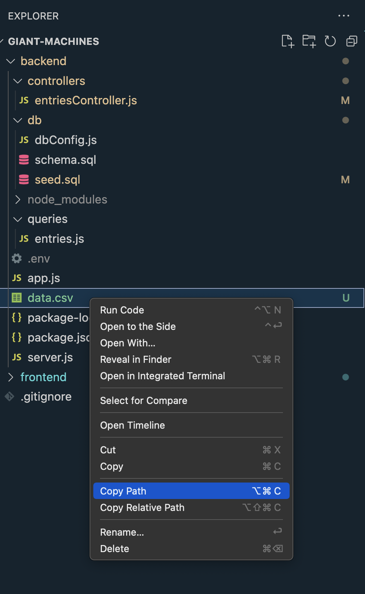
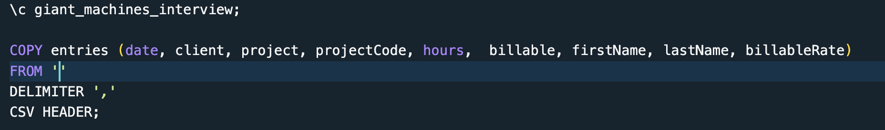
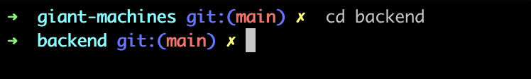
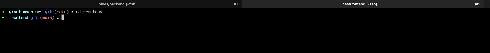

## Project Setup

---

### Getting started

1. Open up the repository in VSCode. Follow the instructions below to complete the setup.

## Instructions

1. Once you have open up the project navigate to the backend folder.

2. Find the data.csv file and right click on it after click on copy path.

    <br/>

3. Navigate to [seed.sql](./backend/db/seed.sql).

4. Paste that path in the empty string right next to

```sql
From
```

 <br/>

1. Go back to the the terminal cd into the backend.

    <br/>

2. Once you have cd into the backend run the following commands in this exact order:

```
npm install
npm run db:init
npm run db:seed
npm start
```

7. Now go back to the terminal and create a new tab and cd into the frontend

 <br/>

8. Once you have cd into the frontend run the following commands in this exact order:

```
npm install
npm start

```
